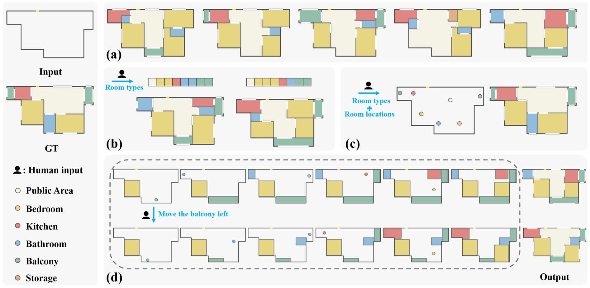

# IPLAN
iPLAN: Interactive and Procedural Layout Planning (CVPR 2022)

Feixiang He, Yanlong Huang, He Wang

[project page](http://drhewang.com/pages/iplan.html) 

Layout design is ubiquitous in many applications, e.g. architecture/urban planning, etc, which involves a lengthy iterative design process. Recently, deep learning has been leveraged to automatically generate layouts via image generation, showing a huge potential to free designers from laborious routines. While automatic generation can greatly boost productivity, designer input is undoubtedly crucial. An ideal AI-aided design tool should automate repetitive routines, and meanwhile accept human guidance and provide smart/proactive suggestions. However, the capability of involving humans into the loop has been largely ignored in existing methods which are mostly end-to-end approaches. To this end, we propose a new human-in-the-loop generative model, iPLAN, which is capable of automatically generating layouts, but also interacting with designers throughout the whole procedure, enabling humans and AI to co-evolve a sketchy idea gradually into the final design. iPLAN is evaluated on diverse datasets and compared with existing methods. The results show that iPLAN has high fidelity in producing similar layouts to those from human designers, great flexibility in accepting designer inputs and providing design suggestions accordingly, and strong generalizability when facing unseen design tasks and limited training data.

#### Contact
If you have any questions about the code, please contact us: Feixiang He(fxhe1992@gmail.com)
